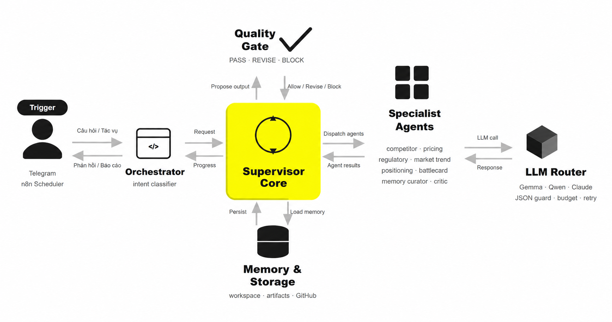

# GreenNode VKS Intelligence — AgentBase Production

## Mô tả use case

Đội ngũ sản phẩm và kinh doanh tại GreenNode cần theo dõi liên tục thị trường Managed Kubernetes Việt Nam — pricing, tính năng mới, chiến lược GTM và động thái đối thủ (Viettel IDC VKS/vOKS, FPT FKE, Bizfly BKE, CMC Cloud, AWS/GCP/Azure). Thu thập thủ công từ nhiều nguồn mỗi ngày tốn 2–3 giờ, dễ bỏ sót tín hiệu quan trọng, và kết quả không nhất quán giữa các thành viên.

Hệ thống multi-agent tự động chạy trên GreenNode AgentBase giải quyết vấn đề này. Mỗi ngày, Supervisor Core kích hoạt các specialist agent song song: `competitor_agent` theo dõi động thái đối thủ, `pricing_agent` phân tích TCO, `regulatory_agent` cập nhật chính sách pháp lý, `market_trend_agent` bám sát xu hướng AI/GPU cloud Việt Nam. Kết quả được tổng hợp qua quality gate tự động (score ≥ 0.80 với deterministic check + LLM critic + citation grader) trước khi phân phối.

**Hai giao diện — người dùng chọn tùy sở thích:**

**Telegram** là kênh tương tác chính, phù hợp cho người dùng di động và muốn nhận thông tin ngay lập tức. Báo cáo tự động gửi vào 8h sáng mỗi ngày, thứ 6 và mùng 1 hàng tháng. Người dùng nhắn trực tiếp cho Lin Lin — QA agent — để hỏi bất kỳ câu hỏi nào về thị trường và nhận trả lời trong vài giây, hoặc ra lệnh research mới. Memory Curator gửi đề xuất cập nhật knowledge base qua Telegram để human review và approve.

**Dashboard web** ([`/dashboard/ui`](https://endpoint-c55e9dec-fbc3-4621-a921-d31c349c3002.agentbase-runtime.aiplatform.vngcloud.vn/dashboard/ui)) dành cho người dùng muốn nhìn tổng quan và audit sâu. Tab Overview hiển thị số run, tỷ lệ thành công, tổng claim; tab Runs liệt kê lịch sử từng pipeline với agent results; tab QA Activity theo dõi câu hỏi và câu trả lời; tab Cost Trend hiển thị token usage theo ngày; tab Evaluation tổng hợp revise rate và citation warnings.

Toàn bộ dữ liệu xử lý trên hạ tầng GreenNode — không có thông tin nào ra ngoài lãnh thổ Việt Nam, tuân thủ data sovereignty theo Luật BVDLCN 2025.

---

## Sơ đồ kiến trúc



**Luồng chính:**
- **Người dùng** gửi câu hỏi qua Telegram hoặc REST API; **Scheduler** (APScheduler) trigger tự động 8h sáng / thứ 6 / mùng 1 hàng tháng
- **Orchestrator** (Gemma) phân loại `intent`: `memory_lookup` → Lin Lin Q&A trả lời nhanh; `current_research` → Supervisor pipeline
- **Supervisor Core** lập plan, dispatch specialist agents song song, collect evidence, synthesize, gọi Quality Gate
- **Quality Gate** kiểm score deterministic (≥ 0.80 publish; < 0.80 → revise 1 lần → `needs_review` alert)
- **Memory & Storage**: load workspace memory trước mỗi run; write-back kết quả mới dưới `outputs/runs/<run_id>/` và commit dated `.md` lên GitHub

**Model pool:** Gemma-4-31b-it (fast — QA, orchestrator, synthesis) · Qwen3-5-27b (reasoning — research, critic)

n8n không chứa reasoning — reasoning nằm trong AgentBase.

---

## Bắt đầu

```bash
uv sync --extra dev          # tạo .venv từ uv.lock
cp .env.example .env         # điền API key + model id
uv run pytest -q             # smoke test
uv run python -m vks_intelligence
```

## Cấu trúc

```text
src/vks_intelligence/   package runtime (app, orchestration, llm, specialists, tools, evals)
prompts/                system prompt tiếng Việt cho từng agent
memory/                 knowledge base (versioned)
outputs/runs/           artifact mỗi run (audit trail)
docker/                 control plane n8n + Postgres + Caddy
n8n/                    workflow export + hợp đồng endpoint
tests/                  smoke test
```

## API surface

```text
GET  /health
POST /tasks/qa
POST /tasks/daily-intelligence
POST /tasks/weekly-digest
POST /tasks/monthly-brief
POST /tasks/competitor-monitor
POST /tasks/pricing-analysis
POST /tasks/battlecard
POST /tasks/memory-maintenance
GET  /tasks/{task_id}
POST /quality/check
GET  /dashboard/summary | /dashboard/runs | /dashboard/evaluation | /dashboard/ui
```

## Đánh giá hệ thống

**Làm tốt:**
- **Quality gate đa tầng** — deterministic check (length, placeholder, required sections, source citation format) + LLM critic + citation grader (HEAD-check URLs) + 1 auto-revise loop trước khi leo thang. Không có output nào qua được mà không có nguồn và timestamp.
- **Audit trail đầy đủ** — mọi run lưu request, plan, agent JSON, quality result, final markdown dưới `outputs/runs/<run_id>/`. Mọi claim trace được về nguồn.
- **Resilient execution** — parallel agents với critical/optional phân biệt rõ; agent phụ fail không chặn run; budget + timeout cứng per task type; JSON guard + retry có chọn lọc cho LLM call.
- **Memory-first** — tiered loading (VN Tier 1 trước hyperscaler), freshness threshold cảnh báo dữ liệu cũ, write-back có approval.
- **Data sovereignty** — toàn bộ data xử lý trên hạ tầng GreenNode, không có thông tin nào ra ngoài lãnh thổ Việt Nam.

**Còn hạn chế:**
- **Scraping thực tế hạn chế** — RSS và Google News là nguồn chính; trang competitor trực tiếp (viettelcloud.vn, fptcloud.com) hầu hết là SPA/JS-rendered nên không scrape được real-time. Pricing tươi phụ thuộc vào tần suất cập nhật memory thủ công.
- **Memory write-back là bán tự động** — Memory Curator đề xuất patch nhưng cần human approve qua Telegram. Memory không tự cập nhật sau mỗi run.
- **QA agent bound bởi memory** — trả lời từ knowledge base; nếu memory stale, câu trả lời stale. Không có cơ chế tự phát hiện khi knowledge base lỗi thời.
- **Không học từ feedback** — hệ thống không ghi nhận báo cáo nào được approve vs reject để điều chỉnh style/depth tự động theo thời gian.
- **Revise loop tối đa 1 lần** — nếu lần revise cũng fail, output chuyển `needs_review` chứ không có thêm vòng tự động.
- **Tốc độ research chưa tối ưu** — query yêu cầu cào dữ liệu và research mới (intent `current_research`) thường mất 60–120 giây do các specialist agent chạy tuần tự theo plan, mỗi agent phải fetch RSS/news rồi tổng hợp qua LLM. Chưa có streaming response hay progress update chi tiết trong khi chờ.

## Trạng thái

Runtime ACTIVE — `v20260617`. Quality gate, revise loop, citation grader, Telegram bot, dashboard observability (overview, runs, QA, cost, eval tab) đã hoạt động production.

## Tài liệu

| File | Nội dung |
|---|---|
| `docs/ARCHITECTURE.md` | Bản đồ đầy đủ: layer map, supervisor pipeline, agent registry, LLM router, data contracts |
| `docs/ARCHITECTURE-VISUAL.html` | Sơ đồ kiến trúc tương tác — 7-node flow diagram (mở bằng browser) |
| `docs/SOURCES.md` | Allowlist social/scrape sources cho evidence collection |
| `CLAUDE.md` | Quy ước repo, deploy workflow, commit policy |
| `BUILD.md` | Build checkpoint, runtime info, incidents |
