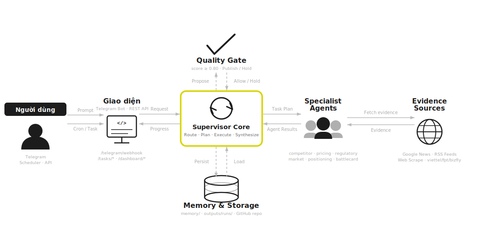

# GreenNode VKS Intelligence — AgentBase Production

Runtime multi-agent production cho competitive intelligence mảng Managed Kubernetes
tại Việt Nam. Project độc lập, Vietnamese-first cho output người dùng, tiếng Anh cho
code/schema/API.

## Sơ đồ kiến trúc



**Luồng chính:**
- **Người dùng** gửi câu hỏi qua Telegram hoặc REST API; **Scheduler** (APScheduler) trigger tự động 8h sáng / thứ 6 / mùng 1 hàng tháng
- **Orchestrator** (Gemma) phân loại `intent`: `memory_lookup` → Lin Lin Q&A trả lời nhanh; `current_research` → Supervisor pipeline
- **Supervisor Core** lập plan, dispatch specialist agents song song, collect evidence, synthesize, gọi Quality Gate
- **Quality Gate** kiểm score deterministic (≥ 0.80 publish; < 0.80 → `needs_review` alert)
- **Memory & Storage**: load workspace memory trước mỗi run; write-back kết quả mới dưới `outputs/runs/<run_id>/` và commit dated `.md` lên GitHub

**Model pool:** Gemma-4-31b-it (fast — QA, orchestrator, synthesis) · Qwen3-5-27b (reasoning — research, critic)

n8n không chứa reasoning — reasoning nằm trong AgentBase.

## Bắt đầu

```bash
uv sync --extra dev          # tạo .venv từ uv.lock
cp .env.example .env         # điền API key + model id
uv run pytest -q             # smoke test vỏ
uv run python -m vks_intelligence
```

## Cấu trúc

Xem `CLAUDE.md` (quy ước repo) và `BUILD.md` (lộ trình implement + bản đồ tri thức).

```text
src/vks_intelligence/   package runtime (app, orchestration, llm, specialists, tools, evals)
prompts/                system prompt tiếng Việt cho từng agent
memory/                 knowledge base (versioned)
outputs/runs/           artifact mỗi run (audit trail)
docker/                 control plane n8n + Postgres + Caddy
n8n/                    workflow export + hợp đồng endpoint
docs/                   plan, kiến trúc
tests/                  smoke test
```

## API surface

```text
GET  /health
POST /tasks/qa
POST /tasks/daily-intelligence
POST /tasks/weekly-digest
POST /tasks/monthly-brief
POST /tasks/competitor-monitor
POST /tasks/pricing-analysis
POST /tasks/battlecard
POST /tasks/memory-maintenance
GET  /tasks/{task_id}
POST /quality/check
GET  /dashboard/summary | /dashboard/runs | /dashboard/ui
```

## Trạng thái

Đang ở checkpoint **runtime foundation đã chạy được**: FastAPI endpoints, supervisor,
specialist registry, model router, evidence bundle, artifact store, Telegram webhook,
dashboard summary và n8n workflow JSON nền đã có. Phần cần harden tiếp là async task
queue đầy đủ, auth/approval production, source registry mở rộng và eval coverage.


## Tài liệu

> Thư mục `docs/` là local-only (gitignored). Mở các file dưới đây trực tiếp trên máy.

| File | Nội dung |
|---|---|
| `docs/architecture-visual.html` | Sơ đồ kiến trúc tương tác — white-background, 7-node flow diagram (mở bằng browser) |
| `docs/architecture.md` | Bản đồ đầy đủ: layer map, supervisor pipeline, agent registry, LLM router, data contracts |
| `CLAUDE.md` | Quy ước repo, deploy workflow, commit policy (trong repo) |
